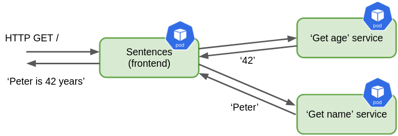

# Istio Katas

This repository contain exercises for the Istio service mesh. Exercises assume
access to a Kubernetes cluster with Istio, Kiali and Jaeger tracing.

## Exercises

### Deployment Patterns and Observability

- [Blue/green Deployments](blue-green-deployment.md)
- [Blue/green Deployments Using Kubernetes Labels](blue-green-deployment-w-labels.md)
- [Canary Deployments](canary-deployment.md)
- [Network Delay Investigations - Simple](request-delays.md)
- [Network Delay Investigations - Larger Application Graph](request-delays-larger-graph.md)
- :construction: WIP: Network Delay Investigations with Jaeger
- [A Tour of the Istio Metrics](metrics.md)

### Designing and Securing the Mesh

- [Getting Traffic into the Mesh with Ingress Gateways](getting-traffic-into-mesh.md)
- [:construction: WIP: Getting Traffic out of the Mesh](egress-gw.md)
- [Multiple Teams and Separation of Duties](multi-teams.md)
- Controlling Load Balancing
- [Locality/Topology Aware Load Balancing and Failover](locality-aware-load-balancing.md)
- [Securing with Mutual TLS](mutual-tls.md)
- [Debugging with Ephemeral Containers](debugging-with-ephemeral-containers.md)
- [When not to use TLS](when-not-to-use-tls.md)
- [Authorization - HTTP Network Policies](authorization.md)
- [Authentication with OIDC](authentication.md)

### Improving Applications

- Circuit Breakers

### Using gRPC

- [:construction: WIP: Using gRPC](using-grpc.md)

### Architectural Patterns

- Multi-mesh and Migrations


## Deployment Patterns

Exercises will cover the following deployment patterns:

- Blue/green. This pattern have multiple service versions deployed for
  test. Tests are being performed against different versions based on a
  **deliberate choice** of the version to use. I.e. this is typically used for
  tests being performed by testers or test frameworks.

- Canary. This pattern have multiple versions deployed for test and both/all
  versions are in active use. The version to use are determined on each request
  based on **statistics**, e.g. *1% of traffic should go to the test
  version*. Typically its end-users that are being exposed to this.

Typically, blue/green and canary deployments are used in succession. First
blue/green deployments are used to validate a new version in a production
environment such that other production-dependencies can be included in the
tests. When deliberate testing using blue/green deployments have proved the
software to be OK, a larger group of users are exposed to the new version using
canary deployments.

Another deployments pattern is:

- A/B testing. With this type of deployment, a certain percentage of end-users
  are exposed to a test version. This is typically used to test out different
  hypothesis, e.g. "a larger 'Buy' button makes users more liable to buy
  products".

## Test Application

The test application implements a simple 'sentences' builder, which can build
sentences from the following simple algorithm:

```
age = random(0,100)
name = random(['Peter','Ray','Egon'])
return name + ' is ' + age + ' years'
```

i.e. it returns sentences of the form: 'Peter is 42 years'.

The application is made up of three services, one which can be queried for the
random age, one which can be queried for a random name and a frontend, which
calls the two other through HTTP requests and formats the final sentences. This
is deployed to Kubernetes using three Deployments - typically with names like
`age`, `name` and `sentences`.



The Python source for the application can be found
[here](sentences-app/app/app.py). Note that the application is a 'test'
application and thus configurable for different test purposes.  Much of the
configuration is through environment variables. The most important environment
variable is `SENTENCE_MODE` which define whether the application is running in
`age`, `name` or `sentences` mode.

### Links

- [Knative katas](https://github.com/MichaelVL/katas-katas)